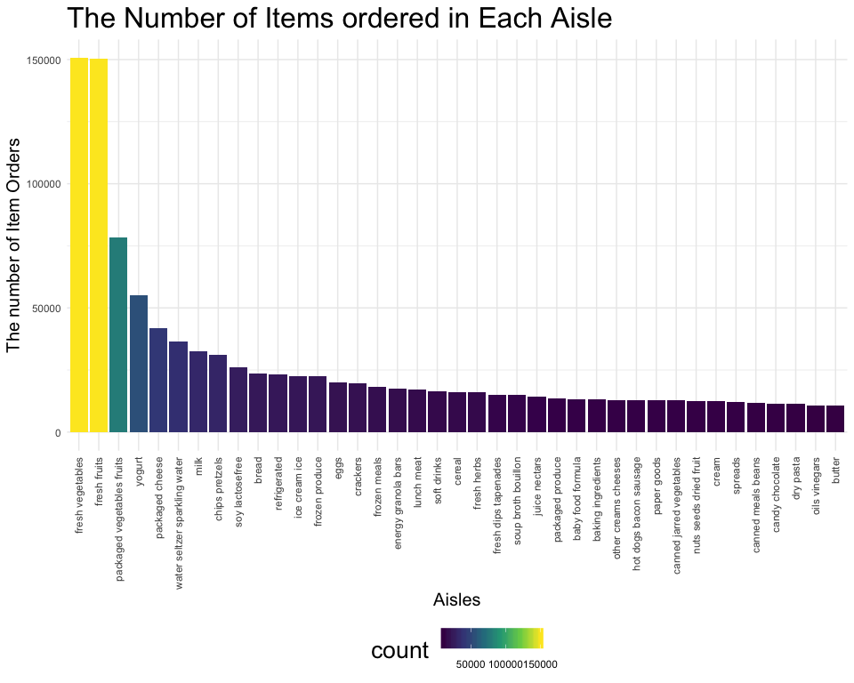
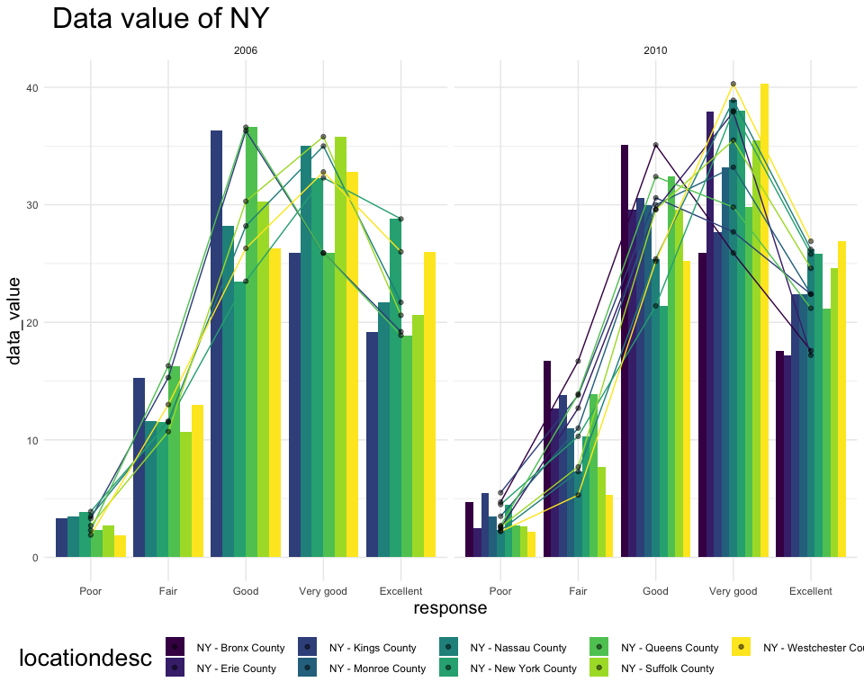

p8105\_hw3\_wx2233
================
Weijia Xiong
10/3/2019

## Problem 1

``` r
data("instacart")
```

The data has 1384617 obs. of 15 variables:

  - order\_id: the id of order
  - user\_id: the id of customer
  - eval\_set: which evaluation set this order belongs in (see SET
    described below)
  - order\_number: the order sequence number for this user (1 = first, n
    = nth)
  - order\_dow: the day of the week the order was placed on
  - order\_hour\_of\_day: the hour of the day the order was placed on
  - days\_since\_prior: days since the last order, capped at 30 (NAs for
    order\_number = 1)
  - product\_id: the id of product
  - product\_name: name of the product
  - aisle\_id: the id of aisle
  - aisle: the name of the aisle
  - department\_id: department identifier
  - department: the name of the department
  - add\_to\_cart\_order: order in which each product was added to cart
  - reordered: whether this product has been ordered by this user in the
    past(1 = yes, 0 =
no)

### a) How many aisles are there, and which aisles are the most items ordered from?

``` r
aisles_data = instacart %>%
  group_by(aisle) %>%
  summarize(count = n()) %>% 
  arrange(desc(count))
aisles_data
```

    ## # A tibble: 134 x 2
    ##    aisle                          count
    ##    <chr>                          <int>
    ##  1 fresh vegetables              150609
    ##  2 fresh fruits                  150473
    ##  3 packaged vegetables fruits     78493
    ##  4 yogurt                         55240
    ##  5 packaged cheese                41699
    ##  6 water seltzer sparkling water  36617
    ##  7 milk                           32644
    ##  8 chips pretzels                 31269
    ##  9 soy lactosefree                26240
    ## 10 bread                          23635
    ## # … with 124 more rows

``` r
number_of_aisles = nrow(aisles_data)
```

There are 134 aisles. Fresh vegetables are the most items orderd
from.

### b) Make a plot that shows the number of items ordered in each aisle, limiting this to aisles with more than 10000 items ordered. Arrange aisles sensibly, and organize your plot so others can read it.

``` r
aisles_data %>%  
  filter(count >= 10000) %>%  #more than 10000 items ordered
  ggplot(aes(x = reorder(aisle,desc(count)), y = count,fill = count)) +  
  geom_bar(stat = 'identity') +
  labs(
    title = "The Number of Items ordered in Each Aisle",
    y = "The number of Item Orders",
    x = 'Aisles') +
  theme(
    axis.text.x = element_text(angle = 90, hjust = 1, vjust = 0.5))
```



The plot shows the number of items ordered in each aisle. From this plot
we can also see that fresh vegetables is the aisle which has most items
ordered.

### c) Make a table showing the three most popular items in each of the aisles “baking ingredients”, “dog food care”, and “packaged vegetables fruits”. Include the number of times each item is ordered in your table.

``` r
bake = instacart %>% 
  filter(aisle == c("baking ingredients")) %>% 
  group_by(aisle, product_name) %>% 
  summarize(
    count = n()
  ) %>%
  arrange(desc(count)) 
bake = bake[1:3,]

dog = instacart %>% 
  filter(aisle == c("dog food care")) %>% 
  group_by(aisle, product_name) %>% 
  summarize(
    count = n()
  ) %>%
  arrange(desc(count)) 
dog = dog[1:3,]

veg_fruit = instacart %>% 
  filter(aisle == c("packaged vegetables fruits")) %>% 
  group_by(aisle, product_name) %>% 
  summarize(
    count = n()
  ) %>%
  arrange(desc(count)) 
veg_fruit = veg_fruit[1:3,]

bind_rows(bake,dog,veg_fruit) %>% 
  knitr::kable()
```

| aisle                      | product\_name                                 | count |
| :------------------------- | :-------------------------------------------- | ----: |
| baking ingredients         | Light Brown Sugar                             |   499 |
| baking ingredients         | Pure Baking Soda                              |   387 |
| baking ingredients         | Cane Sugar                                    |   336 |
| dog food care              | Snack Sticks Chicken & Rice Recipe Dog Treats |    30 |
| dog food care              | Organix Chicken & Brown Rice Recipe           |    28 |
| dog food care              | Small Dog Biscuits                            |    26 |
| packaged vegetables fruits | Organic Baby Spinach                          |  9784 |
| packaged vegetables fruits | Organic Raspberries                           |  5546 |
| packaged vegetables fruits | Organic Blueberries                           |  4966 |

The most popular item of baking ingredients is Light Brown Sugar, which
has bought 499 times. The most popular item from dog food care is Snack
Sticks Chicken & Rice Recipe Dog Treats, which has bought 30 times. And
the most popular item from packaged vegetables fruits is Organic Baby
Spinach, which has bought 9784
times.

### d) Make a table showing the mean hour of the day at which Pink Lady Apples and Coffee Ice Cream are ordered on each day of the week; format this table for human readers (i.e. produce a 2 x 7 table)

``` r
instacart %>% 
  filter(product_name %in% c("Pink Lady Apple", "Coffee Ice Cream")) %>%
  group_by(product_name,order_dow) %>% 
  summarize(
    mean_hour = mean(order_hour_of_day)
  ) %>% 
  pivot_wider(
    names_from = order_dow,
    values_from = mean_hour
  ) %>% 
  knitr::kable()
```

| product\_name    |        0 |        1 |        2 |        3 |        4 |        5 |        6 |
| :--------------- | -------: | -------: | -------: | -------: | -------: | -------: | -------: |
| Coffee Ice Cream | 13.77419 | 14.31579 | 15.38095 | 15.31818 | 15.21739 | 12.26316 | 13.83333 |
| Pink Lady Apple  | 14.40000 | 14.20000 | 13.20000 |  8.00000 | 11.00000 | 16.00000 | 13.00000 |

From this table we find that the pink lady apple has no order on
Saturday(day 6). And people like to order this two products on Tuesday.
People don’t like to order Coffee Ice Cream on Friday and Pink Lady
Apple on Wednesday.

## Problem 2

### Tidy data

``` r
data("brfss_smart2010")
brfss = brfss_smart2010

brfss = brfss %>% 
  janitor::clean_names() %>% 
  filter(topic == "Overall Health", response %in% c("Excellent","Very good","Good","Fair","Poor")) %>% 
  mutate(
    response = factor(response,levels = c("Poor","Fair","Good","Very good","Excellent"))
  ) %>% 
  rename(state = locationabbr)

brfss
```

    ## # A tibble: 10,625 x 23
    ##     year state locationdesc class topic question response sample_size
    ##    <int> <chr> <chr>        <chr> <chr> <chr>    <fct>          <int>
    ##  1  2010 AL    AL - Jeffer… Heal… Over… How is … Excelle…          94
    ##  2  2010 AL    AL - Jeffer… Heal… Over… How is … Very go…         148
    ##  3  2010 AL    AL - Jeffer… Heal… Over… How is … Good             208
    ##  4  2010 AL    AL - Jeffer… Heal… Over… How is … Fair             107
    ##  5  2010 AL    AL - Jeffer… Heal… Over… How is … Poor              45
    ##  6  2010 AL    AL - Mobile… Heal… Over… How is … Excelle…          91
    ##  7  2010 AL    AL - Mobile… Heal… Over… How is … Very go…         177
    ##  8  2010 AL    AL - Mobile… Heal… Over… How is … Good             224
    ##  9  2010 AL    AL - Mobile… Heal… Over… How is … Fair             120
    ## 10  2010 AL    AL - Mobile… Heal… Over… How is … Poor              66
    ## # … with 10,615 more rows, and 15 more variables: data_value <dbl>,
    ## #   confidence_limit_low <dbl>, confidence_limit_high <dbl>,
    ## #   display_order <int>, data_value_unit <chr>, data_value_type <chr>,
    ## #   data_value_footnote_symbol <chr>, data_value_footnote <chr>,
    ## #   data_source <chr>, class_id <chr>, topic_id <chr>, location_id <chr>,
    ## #   question_id <chr>, respid <chr>, geo_location <chr>

### a) In 2002, which states were observed at 7 or more locations? What about in 2010?

``` r
brfss %>% 
  filter(year == 2002) %>% 
  group_by(state) %>% 
  summarize(
    count = n()
  ) %>% 
  filter(count >= 7)
```

    ## # A tibble: 36 x 2
    ##    state count
    ##    <chr> <int>
    ##  1 AZ       10
    ##  2 CO       20
    ##  3 CT       35
    ##  4 DE       15
    ##  5 FL       35
    ##  6 GA       15
    ##  7 HI       20
    ##  8 ID       10
    ##  9 IL       15
    ## 10 IN       10
    ## # … with 26 more rows

``` r
brfss %>% 
  filter(year == 2010) %>% 
  group_by(state) %>% 
  summarize(
    count = n()
  ) %>% 
  filter(count >= 7)
```

    ## # A tibble: 45 x 2
    ##    state count
    ##    <chr> <int>
    ##  1 AL       15
    ##  2 AR       15
    ##  3 AZ       15
    ##  4 CA       60
    ##  5 CO       35
    ##  6 CT       25
    ##  7 DE       15
    ##  8 FL      205
    ##  9 GA       20
    ## 10 HI       20
    ## # … with 35 more rows

2002: GA,MA,ME,NJ,OH,PA,RI  
2010:
CA,CO,FL,ID,MA,MD,ME,NC,NY,OH,PA,SC,TN,TX,UT

### b) Construct a dataset that is limited to Excellent responses, and contains, year, state, and a variable that averages the data\_value across locations within a state. Make a “spaghetti” plot of this average value over time within a state (that is, make a plot showing a line for each state across years – the geom\_line geometry and group aesthetic will help).

``` r
ext_avg_data_value = brfss %>% 
  filter(response == "Excellent") %>% 
  select(year,state,data_value) %>% 
  group_by(year,state) %>% 
  summarize(
    average_value = mean(data_value,na.rm = TRUE)
  )

ext_avg_data_value
```

    ## # A tibble: 443 x 3
    ## # Groups:   year [9]
    ##     year state average_value
    ##    <int> <chr>         <dbl>
    ##  1  2002 AK             27.9
    ##  2  2002 AL             18.5
    ##  3  2002 AR             24.1
    ##  4  2002 AZ             24.1
    ##  5  2002 CA             22.7
    ##  6  2002 CO             23.1
    ##  7  2002 CT             29.1
    ##  8  2002 DC             29.3
    ##  9  2002 DE             20.9
    ## 10  2002 FL             25.7
    ## # … with 433 more rows

``` r
ext_avg_data_value %>% 
  ggplot(aes(x = year, y = average_value)) +
  geom_line(aes(group = state,color = state)) +
  theme(
    legend.position = "right"
  ) +
  labs(
    y = "Average Value",
    x = "Year",
    title = "Average value over time within a state"
  )
```


The average data value fluctuates by years for each
state.

### c) Make a two-panel plot showing, for the years 2006, and 2010, distribution of data\_value for responses (“Poor” to “Excellent”) among locations in NY State.

``` r
NY_data_value = brfss %>% 
  filter(year == 2006 | year == 2010,state == "NY") %>% 
  select(year,state,locationdesc,response,data_value)

NY_data_value %>% 
ggplot(aes(x = response, y = data_value,fill = locationdesc)) +
  geom_bar(stat = "identity", position = "dodge") +
  geom_line(aes(group = locationdesc, color = locationdesc))+
  labs(
    title = " Data value of NY"
  ) +
  facet_grid(. ~ year)
```


Only 6 counties’ data are collected in 2006 while 9 counties in 2010.
And the Good and Very good response are most common in both two
years.

## Problem 3

### a) Load, tidy, and otherwise wrangle the data. Your final dataset should include all originally observed variables and values; have useful variable names; include a weekday vs weekend variable; and encode data with reasonable variable classes. Describe the resulting dataset (e.g. what variables exist, how many observations, etc).

``` r
accel = read_csv("./data/accel_data.csv")%>% 
  janitor::clean_names() %>% 
  mutate(
    weekday_weekend = recode(day,
                             "Monday" = "weekday",
                             "Tuesday" = "weekday",
                             "Wednesday" = "weekday",
                             "Thursday" = "weekday",
                             "Friday" = "weekday",
                             "Saturday" = "weekend",
                             "Sunday" = "weekend")
  ) %>% 
  select(week,weekday_weekend,everything()) %>% 
  pivot_longer(
    starts_with("activity_"),
    names_to = "activity_minute", 
    names_prefix = "activity_",
    values_to = "counts") %>% 
  arrange(day_id)
```

    ## Parsed with column specification:
    ## cols(
    ##   .default = col_double(),
    ##   day = col_character()
    ## )

    ## See spec(...) for full column specifications.

``` r
accel
```

    ## # A tibble: 50,400 x 6
    ##     week weekday_weekend day_id day    activity_minute counts
    ##    <dbl> <chr>            <dbl> <chr>  <chr>            <dbl>
    ##  1     1 weekday              1 Friday 1                 88.4
    ##  2     1 weekday              1 Friday 2                 82.2
    ##  3     1 weekday              1 Friday 3                 64.4
    ##  4     1 weekday              1 Friday 4                 70.0
    ##  5     1 weekday              1 Friday 5                 75.0
    ##  6     1 weekday              1 Friday 6                 66.3
    ##  7     1 weekday              1 Friday 7                 53.8
    ##  8     1 weekday              1 Friday 8                 47.8
    ##  9     1 weekday              1 Friday 9                 55.5
    ## 10     1 weekday              1 Friday 10                43.0
    ## # … with 50,390 more rows

THe data has 50400 obs. of 6 variables:

  - week: which week
  - weekday\_weekend: whether weekday or weekend
  - day\_id: id of the day (id = 1~35)
  - day: which day of a week
  - activity\_minute: the minute of 24-hour day
  - count: the activity counts for each minute of a 24-hour day starting
    at
midnight.

### b) Traditional analyses of accelerometer data focus on the total activity over the day. Using your tidied dataset, aggregate accross minutes to create a total activity variable for each day, and create a table showing these totals. Are any trends apparent?

``` r
accel_total = accel %>% 
  group_by(day_id) %>% 
  summarize(
    total = sum(counts,na.rm = TRUE)
  ) 
accel_total 
```

    ## # A tibble: 35 x 2
    ##    day_id   total
    ##     <dbl>   <dbl>
    ##  1      1 480543.
    ##  2      2  78828.
    ##  3      3 376254 
    ##  4      4 631105 
    ##  5      5 355924.
    ##  6      6 307094.
    ##  7      7 340115.
    ##  8      8 568839 
    ##  9      9 295431 
    ## 10     10 607175 
    ## # … with 25 more rows

``` r
# accel_total %>% 
#   ggplot(aes(x = day_id, y = total )) +
#   geom_line() +
#   scale_x_continuous(breaks = seq(0, 35, 2))
```

The activity counts have upper and lower fluctuation. Decreasing always
occurs after increasing on last day. And the activity counts dramaticly
decrease on day 24 and 31, both are
Saturday.

### c) Accelerometer data allows the inspection activity over the course of the day. Make a single-panel plot that shows the 24-hour activity time courses for each day and use color to indicate day of the week. Describe in words any patterns or conclusions you can make based on this graph.

``` r
accel %>% 
  group_by(day_id,day) %>% 
  summarize(
    eachday = sum(counts,na.rm = TRUE)
  ) %>%
  ggplot(aes(x = day_id, y = eachday, color = day)) +
  geom_line(size = 1.5) +
  scale_x_continuous(breaks = seq(0, 35, 5)) +
  labs(
    x = "activity for each day",
    y = "day id",
    title = "The 24-hour Activity Time Courses for Each Day"
  )
```


For first 10 days, the activity counts are increasing except Sunday.
Then the activity counts decrease from day 11 to around day 25. For
Saturday in last two weeks, both activity counts of the day decrease to
1440.
