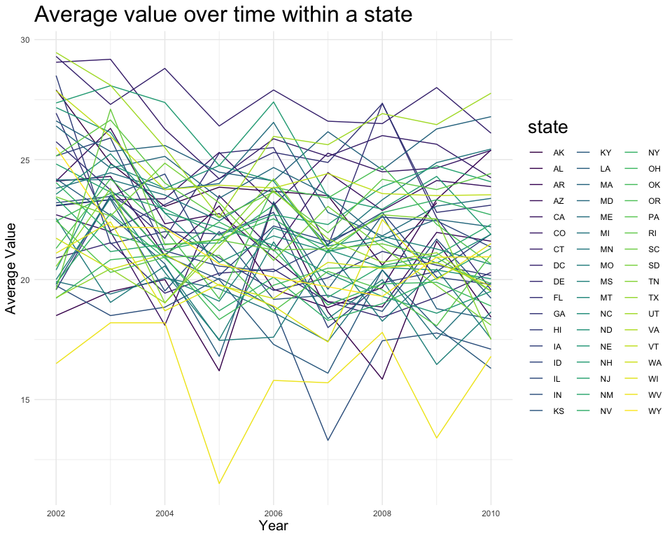
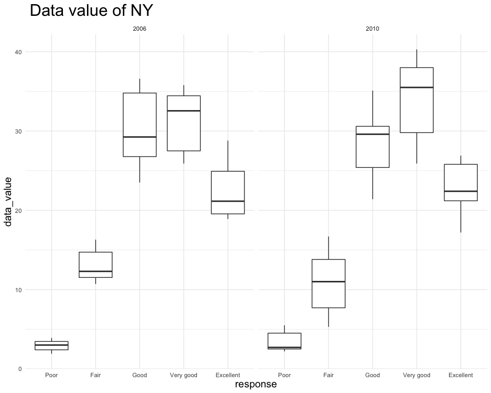

p8105\_hw3\_wx2233
================
Weijia Xiong
10/3/2019

## Problem 1

``` r
data("instacart")
```

The data has 1384617 obs. of 15 variables:

  - order\_id: the id of order
  - user\_id: the id of customer
  - eval\_set: which evaluation set this order belongs in
  - order\_number: the order sequence number for this user (1 = first, n
    = nth)
  - order\_dow: the day of the week the order was placed on
  - order\_hour\_of\_day: the hour of the day the order was placed on
  - days\_since\_prior: days since the last order, capped at 30 (NAs for
    order\_number = 1)
  - product\_id: the id of product
  - product\_name: name of the product
  - aisle\_id: the id of aisle
  - aisle: the name of the aisle
  - department\_id: department identifier
  - department: the name of the department
  - add\_to\_cart\_order: order in which each product was added to cart
  - reordered: whether this product has been ordered by this user in the
    past(1 = yes, 0 = no)

Example of obs: The product name is Bulgarian Yogurt, it belongs to
yogurt aisle(id = 120) and dairy eggs department(id = 16), days since
prior order is 9, the hour of the day the order was placed on is 10, the
day of the week the order was placed on is Thusday, the order sequence
number is 4. And the evaluation set is train. The user id is 112108.

``` r
instacart[1,]
```

    ## # A tibble: 1 x 15
    ##   order_id product_id add_to_cart_ord… reordered user_id eval_set
    ##      <int>      <int>            <int>     <int>   <int> <chr>   
    ## 1        1      49302                1         1  112108 train   
    ## # … with 9 more variables: order_number <int>, order_dow <int>,
    ## #   order_hour_of_day <int>, days_since_prior_order <int>,
    ## #   product_name <chr>, aisle_id <int>, department_id <int>, aisle <chr>,
    ## #   department <chr>

Structure: each row is an observation, each column is a
    variable.

``` r
str(instacart)
```

    ## Classes 'tbl_df', 'tbl' and 'data.frame':    1384617 obs. of  15 variables:
    ##  $ order_id              : int  1 1 1 1 1 1 1 1 36 36 ...
    ##  $ product_id            : int  49302 11109 10246 49683 43633 13176 47209 22035 39612 19660 ...
    ##  $ add_to_cart_order     : int  1 2 3 4 5 6 7 8 1 2 ...
    ##  $ reordered             : int  1 1 0 0 1 0 0 1 0 1 ...
    ##  $ user_id               : int  112108 112108 112108 112108 112108 112108 112108 112108 79431 79431 ...
    ##  $ eval_set              : chr  "train" "train" "train" "train" ...
    ##  $ order_number          : int  4 4 4 4 4 4 4 4 23 23 ...
    ##  $ order_dow             : int  4 4 4 4 4 4 4 4 6 6 ...
    ##  $ order_hour_of_day     : int  10 10 10 10 10 10 10 10 18 18 ...
    ##  $ days_since_prior_order: int  9 9 9 9 9 9 9 9 30 30 ...
    ##  $ product_name          : chr  "Bulgarian Yogurt" "Organic 4% Milk Fat Whole Milk Cottage Cheese" "Organic Celery Hearts" "Cucumber Kirby" ...
    ##  $ aisle_id              : int  120 108 83 83 95 24 24 21 2 115 ...
    ##  $ department_id         : int  16 16 4 4 15 4 4 16 16 7 ...
    ##  $ aisle                 : chr  "yogurt" "other creams cheeses" "fresh vegetables" "fresh vegetables" ...
    ##  $ department            : chr  "dairy eggs" "dairy eggs" "produce" "produce" ...
    ##  - attr(*, "spec")=
    ##   .. cols(
    ##   ..   order_id = col_integer(),
    ##   ..   product_id = col_integer(),
    ##   ..   add_to_cart_order = col_integer(),
    ##   ..   reordered = col_integer(),
    ##   ..   user_id = col_integer(),
    ##   ..   eval_set = col_character(),
    ##   ..   order_number = col_integer(),
    ##   ..   order_dow = col_integer(),
    ##   ..   order_hour_of_day = col_integer(),
    ##   ..   days_since_prior_order = col_integer(),
    ##   ..   product_name = col_character(),
    ##   ..   aisle_id = col_integer(),
    ##   ..   department_id = col_integer(),
    ##   ..   aisle = col_character(),
    ##   ..   department = col_character()
    ##   .. )

### a)

``` r
aisles_data = instacart %>%
  group_by(aisle) %>%
  summarize(count = n()) %>% 
  arrange(desc(count))
aisles_data
```

    ## # A tibble: 134 x 2
    ##    aisle                          count
    ##    <chr>                          <int>
    ##  1 fresh vegetables              150609
    ##  2 fresh fruits                  150473
    ##  3 packaged vegetables fruits     78493
    ##  4 yogurt                         55240
    ##  5 packaged cheese                41699
    ##  6 water seltzer sparkling water  36617
    ##  7 milk                           32644
    ##  8 chips pretzels                 31269
    ##  9 soy lactosefree                26240
    ## 10 bread                          23635
    ## # … with 124 more rows

``` r
number_of_aisles = nrow(aisles_data)
```

There are 134 aisles. Fresh vegetables are the most items orderd from.

### b)

``` r
aisles_data %>%  
  filter(count >= 10000) %>%  #more than 10000 items ordered
  ggplot(aes(x = reorder(aisle,desc(count)), y = count,fill = count)) +  
  geom_bar(stat = 'identity') +
  labs(
    title = "The Number of Items ordered in Each Aisle",
    y = "The number of Item Orders",
    x = 'Aisles') +
  theme(
    axis.text.x = element_text(angle = 90, hjust = 1, vjust = 0.5))
```


The plot shows the number of items ordered in each aisle. From this plot
we can also see that fresh vegetables is the aisle which has most items
ordered.

### c)

``` r
bake = instacart %>% 
  filter(aisle == c("baking ingredients")) %>% 
  group_by(aisle, product_name) %>% 
  summarize(
    count = n()
  ) %>%
  arrange(desc(count)) 
bake = bake[c(1:3),]

dog = instacart %>% 
  filter(aisle == c("dog food care")) %>% 
  group_by(aisle, product_name) %>% 
  summarize(
    count = n()
  ) %>%
  arrange(desc(count)) 
dog = dog[c(1:3),]

veg_fruit = instacart %>% 
  filter(aisle == c("packaged vegetables fruits")) %>% 
  group_by(aisle, product_name) %>% 
  summarize(
    count = n()
  ) %>%
  arrange(desc(count)) 
veg_fruit = veg_fruit[c(1:3),]

bind_rows(bake,dog,veg_fruit) %>% 
  knitr::kable()
```

| aisle                      | product\_name                                 | count |
| :------------------------- | :-------------------------------------------- | ----: |
| baking ingredients         | Light Brown Sugar                             |   499 |
| baking ingredients         | Pure Baking Soda                              |   387 |
| baking ingredients         | Cane Sugar                                    |   336 |
| dog food care              | Snack Sticks Chicken & Rice Recipe Dog Treats |    30 |
| dog food care              | Organix Chicken & Brown Rice Recipe           |    28 |
| dog food care              | Small Dog Biscuits                            |    26 |
| packaged vegetables fruits | Organic Baby Spinach                          |  9784 |
| packaged vegetables fruits | Organic Raspberries                           |  5546 |
| packaged vegetables fruits | Organic Blueberries                           |  4966 |

The most popular item of baking ingredients is Light Brown Sugar, which
has bought been 499 times. The most popular item from dog food care is
Snack Sticks Chicken & Rice Recipe Dog Treats, which has been bought 30
times. And the most popular item from packaged vegetables fruits is
Organic Baby Spinach, which has been bought 9784
times.

### d) Make a table showing the mean hour of the day at which Pink Lady Apples and Coffee Ice Cream are ordered on each day of the week; format this table for human readers (i.e. produce a 2 x 7 table)

``` r
instacart %>% 
  filter(product_name %in% c("Pink Lady Apples","Coffee Ice Cream")) %>%
  mutate(
    order_dow = factor(order_dow, labels  = 
                             c("Sunday","Monday","Tuesday","Wednesday",
                              "Thursday","Friday","Saturday"))
    ) %>% 
  group_by(product_name,order_dow) %>% 
  summarize(
    mean_hour = round(mean(order_hour_of_day),2)
  ) %>% 
  pivot_wider(
    names_from = order_dow,
    values_from = mean_hour
  ) %>%
  knitr::kable()
```

| product\_name    | Sunday | Monday | Tuesday | Wednesday | Thursday | Friday | Saturday |
| :--------------- | -----: | -----: | ------: | --------: | -------: | -----: | -------: |
| Coffee Ice Cream |  13.77 |  14.32 |   15.38 |     15.32 |    15.22 |  12.26 |    13.83 |
| Pink Lady Apples |  13.44 |  11.36 |   11.70 |     14.25 |    11.55 |  12.78 |    11.94 |

From this table we find that the pink lady apple has least orders on
Monday and most orders on Wednesday. Coffee Ice Cream has least orders
on Friday but most on Tuesday.

## Problem 2

### Tidy data

``` r
data("brfss_smart2010")
brfss = brfss_smart2010

brfss = brfss %>% 
  janitor::clean_names() %>% 
  filter(topic == "Overall Health", response %in% c("Excellent","Very good","Good","Fair","Poor")) %>% 
  mutate(
    response = factor(response,levels = c("Poor","Fair","Good","Very good","Excellent"))
  ) %>% 
  rename(state = locationabbr)

brfss
```

    ## # A tibble: 10,625 x 23
    ##     year state locationdesc class topic question response sample_size
    ##    <int> <chr> <chr>        <chr> <chr> <chr>    <fct>          <int>
    ##  1  2010 AL    AL - Jeffer… Heal… Over… How is … Excelle…          94
    ##  2  2010 AL    AL - Jeffer… Heal… Over… How is … Very go…         148
    ##  3  2010 AL    AL - Jeffer… Heal… Over… How is … Good             208
    ##  4  2010 AL    AL - Jeffer… Heal… Over… How is … Fair             107
    ##  5  2010 AL    AL - Jeffer… Heal… Over… How is … Poor              45
    ##  6  2010 AL    AL - Mobile… Heal… Over… How is … Excelle…          91
    ##  7  2010 AL    AL - Mobile… Heal… Over… How is … Very go…         177
    ##  8  2010 AL    AL - Mobile… Heal… Over… How is … Good             224
    ##  9  2010 AL    AL - Mobile… Heal… Over… How is … Fair             120
    ## 10  2010 AL    AL - Mobile… Heal… Over… How is … Poor              66
    ## # … with 10,615 more rows, and 15 more variables: data_value <dbl>,
    ## #   confidence_limit_low <dbl>, confidence_limit_high <dbl>,
    ## #   display_order <int>, data_value_unit <chr>, data_value_type <chr>,
    ## #   data_value_footnote_symbol <chr>, data_value_footnote <chr>,
    ## #   data_source <chr>, class_id <chr>, topic_id <chr>, location_id <chr>,
    ## #   question_id <chr>, respid <chr>, geo_location <chr>

### a) In 2002, which states were observed at 7 or more locations? What about in 2010?

``` r
brfss %>% 
  filter(year == 2002 | year == 2010) %>% 
  group_by(year, state) %>% 
  distinct(locationdesc) %>% 
  summarize(
    count = n()
  ) %>% 
  filter(count >= 7) %>% 
  knitr::kable()
```

| year | state | count |
| ---: | :---- | ----: |
| 2002 | CT    |     7 |
| 2002 | FL    |     7 |
| 2002 | MA    |     8 |
| 2002 | NC    |     7 |
| 2002 | NJ    |     8 |
| 2002 | PA    |    10 |
| 2010 | CA    |    12 |
| 2010 | CO    |     7 |
| 2010 | FL    |    41 |
| 2010 | MA    |     9 |
| 2010 | MD    |    12 |
| 2010 | NC    |    12 |
| 2010 | NE    |    10 |
| 2010 | NJ    |    19 |
| 2010 | NY    |     9 |
| 2010 | OH    |     8 |
| 2010 | PA    |     7 |
| 2010 | SC    |     7 |
| 2010 | TX    |    16 |
| 2010 | WA    |    10 |

2002: CT,FL,MA,NC,NJ,PA  
2010:
CA,CO,FL,MA,MD,NC,NE,NJ,NY,OH,PA,SC,TX,WA

### b) Construct a dataset that is limited to Excellent responses, and contains, year, state, and a variable that averages the data\_value across locations within a state. Make a “spaghetti” plot of this average value over time within a state (that is, make a plot showing a line for each state across years – the geom\_line geometry and group aesthetic will help).

``` r
ext_avg_data_value = brfss %>% 
  filter(response == "Excellent") %>% 
  select(year,state,data_value) %>% 
  group_by(year,state) %>% 
  summarize(
    average_value = mean(data_value,na.rm = TRUE)
  )

ext_avg_data_value
```

    ## # A tibble: 443 x 3
    ## # Groups:   year [9]
    ##     year state average_value
    ##    <int> <chr>         <dbl>
    ##  1  2002 AK             27.9
    ##  2  2002 AL             18.5
    ##  3  2002 AR             24.1
    ##  4  2002 AZ             24.1
    ##  5  2002 CA             22.7
    ##  6  2002 CO             23.1
    ##  7  2002 CT             29.1
    ##  8  2002 DC             29.3
    ##  9  2002 DE             20.9
    ## 10  2002 FL             25.7
    ## # … with 433 more rows

``` r
ext_avg_data_value %>% 
  ggplot(aes(x = year, y = average_value)) +
  geom_line(aes(group = state,color = state)) +
  theme(
    legend.position = "right"
  ) +
  labs(
    y = "Average Value",
    x = "Year",
    title = "Average value over time within a state"
  )
```



The average data value fluctuates by years for each
state.

### c) Make a two-panel plot showing, for the years 2006, and 2010, distribution of data\_value for responses (“Poor” to “Excellent”) among locations in NY State.

We can draw the plot from 2 prospective. First plot : for different
response, the group is location.

``` r
NY_data_value = brfss %>%
  filter(year == 2006 | year == 2010,state == "NY") %>%
  select(year,state,locationdesc,response,data_value)

NY_data_value %>%
ggplot(aes(x = response, y = data_value,fill = locationdesc)) +
  geom_bar(stat = "identity", position = "dodge") +
  geom_line(aes(group = locationdesc, color = locationdesc)) +
  geom_point(size = 1.5, alpha = 0.5) +
  labs(
    title = " Data value of NY"
  ) +
  facet_grid(. ~ year)
```



Second plot: for different locations, group is response. We can clearly
see the change of response among different locations.

``` r
NY_data_value = brfss %>% 
filter(year == 2006 | year == 2010,state == "NY") %>% 
select(year,state,locationdesc,response,data_value)  
NY_data_value
```

    ## # A tibble: 75 x 5
    ##     year state locationdesc      response  data_value
    ##    <int> <chr> <chr>             <fct>          <dbl>
    ##  1  2010 NY    NY - Bronx County Excellent       17.6
    ##  2  2010 NY    NY - Bronx County Very good       25.9
    ##  3  2010 NY    NY - Bronx County Good            35.1
    ##  4  2010 NY    NY - Bronx County Fair            16.7
    ##  5  2010 NY    NY - Bronx County Poor             4.7
    ##  6  2010 NY    NY - Erie County  Excellent       17.2
    ##  7  2010 NY    NY - Erie County  Very good       37.9
    ##  8  2010 NY    NY - Erie County  Good            29.6
    ##  9  2010 NY    NY - Erie County  Fair            12.7
    ## 10  2010 NY    NY - Erie County  Poor             2.5
    ## # … with 65 more rows

``` r
NY_data_value %>% 
ggplot(aes(x = locationdesc, y = data_value,fill = response)) +
  geom_line(aes(group = response, color = response),size = 1.5) +
  geom_point(size = 2, alpha = 0.5) +
  labs(
    title = " Data value distribution of NY"
  ) +
  facet_grid(. ~ year) +
  theme(
    axis.text.x = element_text(angle = 90, hjust = 1, vjust = 0.5),
    legend.position = "right")
```


Only 6 counties’ data are collected in 2006 while 9 counties in 2010.
And the Good and Very good response are most common in both two years.

## Problem 3

### a)

``` r
accel = read_csv("./data/accel_data.csv") %>% 
  janitor::clean_names() %>% 
  mutate(
    weekday_weekend = recode(day,
                             "Monday" = "weekday",
                             "Tuesday" = "weekday",
                             "Wednesday" = "weekday",
                             "Thursday" = "weekday",
                             "Friday" = "weekday",
                             "Saturday" = "weekend",
                             "Sunday" = "weekend"),
    weekday_weekend = factor(weekday_weekend),
    day = factor(day,
                 levels = c("Monday","Tuesday","Wednesday","Thursday","Friday","Saturday","Sunday"))
  ) %>% 
  select(week,weekday_weekend,everything()) %>% 
  pivot_longer(
    starts_with("activity_"),
    names_to = "activity_minute", 
    names_prefix = "activity_",
    values_to = "counts") %>% 
  mutate(
    activity_minute = as.numeric(activity_minute)
  )
```

    ## Parsed with column specification:
    ## cols(
    ##   .default = col_double(),
    ##   day = col_character()
    ## )

    ## See spec(...) for full column specifications.

``` r
accel
```

    ## # A tibble: 50,400 x 6
    ##     week weekday_weekend day_id day    activity_minute counts
    ##    <dbl> <fct>            <dbl> <fct>            <dbl>  <dbl>
    ##  1     1 weekday              1 Friday               1   88.4
    ##  2     1 weekday              1 Friday               2   82.2
    ##  3     1 weekday              1 Friday               3   64.4
    ##  4     1 weekday              1 Friday               4   70.0
    ##  5     1 weekday              1 Friday               5   75.0
    ##  6     1 weekday              1 Friday               6   66.3
    ##  7     1 weekday              1 Friday               7   53.8
    ##  8     1 weekday              1 Friday               8   47.8
    ##  9     1 weekday              1 Friday               9   55.5
    ## 10     1 weekday              1 Friday              10   43.0
    ## # … with 50,390 more rows

The data has 50400 obs. of 6 variables:

  - week: which week
  - weekday\_weekend: whether weekday or weekend
  - day\_id: id of the day
  - day: factor variable shows which day of a week
  - activity\_minute: the minute of a 24-hour day
  - count: the activity counts for each minute of a 24-hour day starting
    at midnight.

### b)

``` r
accel_new =
accel %>% 
  mutate(
    week_day = recode(day,
                     "Monday" = "1",
                     "Tuesday" = "2",
                     "Wednesday" = "3",
                     "Thursday" = "4",
                     "Friday" = "5",
                     "Saturday" = "6",
                     "Sunday" = "7")
  ) %>% 
  arrange(week,week_day) %>%
  mutate(
    day_index = rep(c(1:35),each = 1440)  #add new day_id 1:35
  ) %>% 
  select(week,week_day,day,day_index,everything())
```

``` r
eachday_total = accel_new %>% 
  group_by(week, week_day, day,day_index) %>% 
  summarize(
    total = sum(counts,na.rm = TRUE)
  )

knitr::kable(eachday_total)
```

| week | week\_day | day       | day\_index |     total |
| ---: | :-------- | :-------- | ---------: | --------: |
|    1 | 1         | Monday    |          1 |  78828.07 |
|    1 | 2         | Tuesday   |          2 | 307094.24 |
|    1 | 3         | Wednesday |          3 | 340115.01 |
|    1 | 4         | Thursday  |          4 | 355923.64 |
|    1 | 5         | Friday    |          5 | 480542.62 |
|    1 | 6         | Saturday  |          6 | 376254.00 |
|    1 | 7         | Sunday    |          7 | 631105.00 |
|    2 | 1         | Monday    |          8 | 295431.00 |
|    2 | 2         | Tuesday   |          9 | 423245.00 |
|    2 | 3         | Wednesday |         10 | 440962.00 |
|    2 | 4         | Thursday  |         11 | 474048.00 |
|    2 | 5         | Friday    |         12 | 568839.00 |
|    2 | 6         | Saturday  |         13 | 607175.00 |
|    2 | 7         | Sunday    |         14 | 422018.00 |
|    3 | 1         | Monday    |         15 | 685910.00 |
|    3 | 2         | Tuesday   |         16 | 381507.00 |
|    3 | 3         | Wednesday |         17 | 468869.00 |
|    3 | 4         | Thursday  |         18 | 371230.00 |
|    3 | 5         | Friday    |         19 | 467420.00 |
|    3 | 6         | Saturday  |         20 | 382928.00 |
|    3 | 7         | Sunday    |         21 | 467052.00 |
|    4 | 1         | Monday    |         22 | 409450.00 |
|    4 | 2         | Tuesday   |         23 | 319568.00 |
|    4 | 3         | Wednesday |         24 | 434460.00 |
|    4 | 4         | Thursday  |         25 | 340291.00 |
|    4 | 5         | Friday    |         26 | 154049.00 |
|    4 | 6         | Saturday  |         27 |   1440.00 |
|    4 | 7         | Sunday    |         28 | 260617.00 |
|    5 | 1         | Monday    |         29 | 389080.00 |
|    5 | 2         | Tuesday   |         30 | 367824.00 |
|    5 | 3         | Wednesday |         31 | 445366.00 |
|    5 | 4         | Thursday  |         32 | 549658.00 |
|    5 | 5         | Friday    |         33 | 620860.00 |
|    5 | 6         | Saturday  |         34 |   1440.00 |
|    5 | 7         | Sunday    |         35 | 138421.00 |

From the table I cannot see the trends clearly so I draw a plot.

``` r
eachday_total %>% 
  ggplot(aes(x = day_index, y = total )) +
  geom_line() +
  scale_x_continuous(breaks = seq(0, 35, 2))
```


The activity counts have upper and lower fluctuation. Decreasing always
occurs after increasing of the day before. And the activity counts
dramaticly decrease on day 27 and 34, both are Saturday.

### c)

``` r
accel_new %>%
  ggplot(aes(x = activity_minute, y = counts, color = day)) +
  geom_line(stat = "identity") +
  scale_x_continuous(breaks = seq(0,1440,60),label = c(0:24)) +
  labs(
    y = "activity for each day",
    x = "24 hours",
    title = "The 24-hour Activity Time Courses for Each Day"
  )
```


We can find that the activity counts during the morning 7am - 9 am and
during the evening around 7pm - 9pm are higher. The activity counts are
lower during midnight and early morning. But I cannot disguish each day
clealy, so I draw another plot to gain more information.

``` r
eachday =
accel_new %>% 
  mutate(
    act_min = activity_minute + 
      1440 * (day_index - 1))

eachday %>% 
  ggplot() +
  geom_linerange(aes(x = act_min, ymax = counts, ymin = 0, color = day)) +
  scale_x_continuous(breaks = seq(0,28*1440,1440*7),label = c(1:5)) +
  labs(
    y = "activity for each day",
    x = "week",
    title = "The 24-hour Activity Time Courses for Each Day"
  )
```


We can find that the activity counts are increasing except Sunday. Then
the activity counts decrease from day 11 to around day 25. For Saturday
in last two weeks, both activity counts of the day decrease to 1440.
